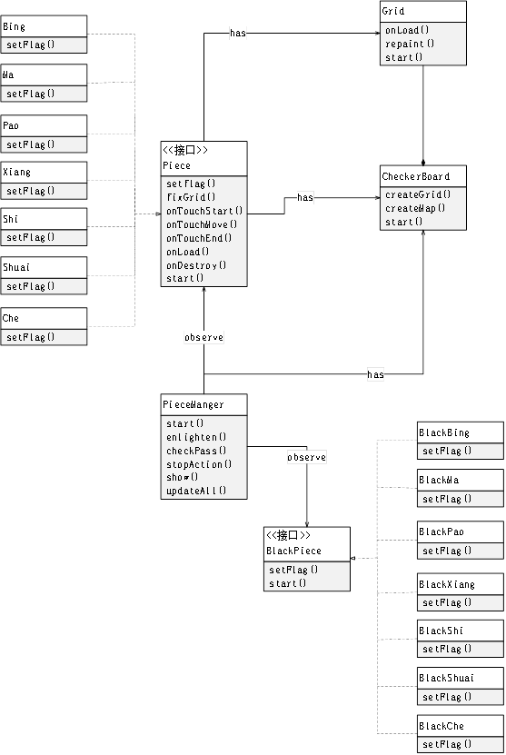

# ChineseChessLight

## 1.	Cocos Creator中脚本目录结构 


**主域：**
```
scripts
│  BlackPiece.js
│  CheckerBoard.js
│  Grid.js
│  InitColor.js
│  Piece.js
│  PieceManager.js
│  Ranking.js
│  Share.js
│  Skip.js
│
├─levels
│
├─music
│      AudioManager.js
│      ButtonMusic.js
│      MusicEvent.js
│
└─piece
```

其中各个文件说明如下：

BlacPiece.js: 所有黑棋的接口，控制黑棋的游戏行为

Piece.js: 所有红棋的接口，控制红棋的游戏行为

CheckerBoard.js: 动态生成游戏棋盘

InitColor.js: 根据通关情况渲染场景文字颜色

Grid.js: 控制棋盘中每个方格的游戏行为

PieceManger.js: 管理所有棋子，对棋子行为进行监听

Share.js 控制场景跳转事件

Ranking.js 发送更改排行榜信息到子域

Skip.js 控制场景跳转事件

levels: 存放关卡数据的文件夹

AudioManger.js: 背景音乐的全局播放

ButtonMusic.js :鼠标点击事件的音乐播放

MusicEvent.js : 背景音乐的开关事件

piece: 该文件夹存放不同棋子的子类，分别控制具体棋子的游戏行为


&nbsp; 

**子域：**
```
openData.js
```
openData.js： 接收主域信息，生成或清空排行榜
   
&nbsp; 

## 2.	游戏逻辑实现


 
### 类方法说明：
#### 1.	Piece:
setflag()标记棋子对周围格子的影响，该方法为抽象方法，将在子类中实现 &nbsp;

fixGrid()确定棋子是否属于某个格子, 若属于, 则更新棋子状态 &nbsp;

onTouchStart() 棋子开始拖动触发, 消除该棋子对周围方格的影响 &nbsp;

onTouchMove() 棋子拖动中, 持续更新棋子坐标 &nbsp;

onTouchEnd() 当棋子下放时, 触发下放音效, 判断棋子是否落于某个格子, 更新所有格子状态，判断是否通关 &nbsp;

#### 2.	BlackPiece
setflag() 使得棋子攻击范围内的红棋失效

#### 3.	CheckerBorad
createGrid() 动态生成格子并将其添加到场景中
createMap() 根据给出的关卡数据动态生成脚本

#### 4.	Grid
repaint() 收到状态更改事件时，重绘方格

#### 5.	PieceManger
enlighten() 更新所有方格状态
checkPass() 检测当前是否通关
stopAction() 通关后暂停所有棋子行为
show() 通关动效
updateAll() 更新所有棋子状态

&nbsp; 

## 3. 总结
### 1.	游戏逻辑实现
首先需要生成游戏场景，即棋盘，而棋盘由10 x 10的方格拼接而成。在此，通过读取关卡数据文件的二维数组确定不同位置的格子种类，之后动态加载方格预制体拼接成棋盘。
本小游戏需要拖动棋子照亮通路以达到通关。对于每个棋子，需要维系一系列不同的标识以记录其状态；当棋子下放时，需要检测位置是否合法，否则返回上次的合法位置；当棋子确定合法落点后，会根据棋子的种类的对周围方格进行更新，而每个方格也会记录自身状态并根据状态进行重绘；最后则会对棋盘进行通关检测，这里通过对比当前已照亮的方格和关卡数据中给出的过关路径是否吻合。
对于不同种类的棋子，其照亮的范围存在差异，这里通过子类继承并重写照亮方法以实现不同的棋子。相较于红棋，黑棋的逻辑较为简单，只需不断检测其攻击范围内的红棋并禁用即可，不同黑棋的攻击范围也是通过子类继承并重写实现。

### 2.	资源管理
为了提示游戏运行速度与减少资源大小，方格棋子等资源被制作成了预制体，而本游戏中的不同的关卡场景，通关动效，都是根据给出关卡数据动态生成。此外，游戏对不同资源进行了分包管理，这使得主包的大小在4M之内，同时也无需向服务器请求资源，提升了运行速度。

### 3.	数据存储 
对每个玩家，其在本地缓存中都会保存通过关卡信息的键值对。另外，玩家的通过关卡总数则被托管在腾讯云中，该数据由本地缓存更新而来， 在子域中被查询以创建排行榜。
